  

 

  
  
  
  

 

## a little context

I build across two connected spaces: **Android systems** and **web experiences**.

One side is about understanding what is underneath the interface: custom ROMs, performance modules, framework behavior, and the small details that make a device feel better. The other is about shaping the interface itself: expressive layouts, interactive websites, and digital work that feels intentional instead of interchangeable.

I am interested in the space where technical depth and visual character meet.

 

## a quiet look at the numbers

  

    
  

  

    
  

 

## routes

<table>
  <tr>
    <td width="50%" valign="top">
      <h3>01 / ROM development</h3>
      
Turning curiosity about Android internals into practical tools and better device experiences.

      
<code>custom ROMs</code> <code>APatch</code> <code>frameworks</code> <code>performance</code>

    </td>
    <td width="50%" valign="top">
      <h3>02 / web development</h3>
      
Building expressive interfaces where structure, motion, and personality support the message.

      
<code>HTML</code> <code>CSS</code> <code>JavaScript</code> <code>interaction</code>

    </td>
  </tr>
</table>

 

## shortcuts ⌁

<table>
  <tr>
    <td width="50%" valign="top">
      <h3>websites</h3>
      

        <a href="https://vnsannn.github.io/my-portfolio">my portfolio</a> 
        <a href="https://vnsannn.github.io/btech-slims">btech-slims</a> 
        <a href="https://vnsannn.github.io/wj-self">wj-self</a>
      

    </td>
    <td width="50%" valign="top">
      <h3>repositories</h3>
      

        <a href="https://github.com/vnsannn/my-portfolio">my-portfolio</a> 
        <a href="https://github.com/vnsannn/btech-slims">btech-slims</a> 
        <a href="https://github.com/vnsannn/wj-self">wj-self</a>
      

    </td>
  </tr>
</table>

 

## languages & tools

  

    
    
    
    
    
    
  

  

    
    
    
    
  

 

  open to meaningful ideas, thoughtful collaborations, and projects worth making

 

  iennn.dev | <a href="mailto:viencalderon15@gmail.com">viencalderon15@gmail.com</a>

<!--
  Identity: iennn.dev / @vnsannn
  Style: candy plasma, clean, playful-professional
  Quote: original philosophical developer line
-->
